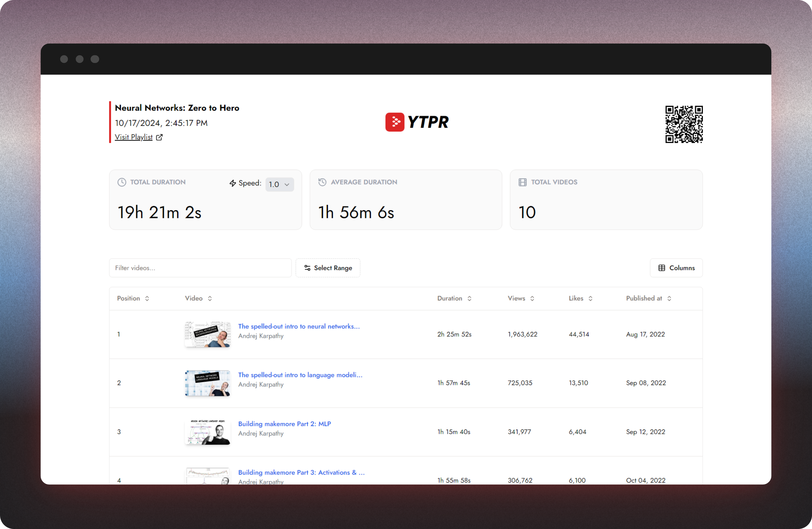

<div align="center">

# [🎞 YouTube Playlist Report](https://ytpr.netlify.app)

Generate comprehensive reports for YouTube playlists. Get insights on total duration, average video length, and detailed statistics for each video.



</div>

## ✨ Features

- Comprehensive Insights: Get detailed info about your playlists, including total duration, average video duration, number of videos, and specific details for each video.
- Playback Speed Adjustment: Customize your viewing experience by adjusting the playback speed from 0.25x to 2x.
- Flexible Sorting Options: Easily sort videos by position, duration, views, likes, or publish date.
- Efficient Filtering: Use the search bar to quickly filter and find specific videos within your playlist.
- Targeted Analysis: Analyze only the portions of the playlist that interest you with a range selector.
- Customizable Table View: Tailor your video table by toggling specific columns.

## 🧰 Tech used

- React
- TypeScript
- Vite
- React Router
- Tanstack Query
- Tailwind CSS
- Shadcn UI
- Framer Motion

## 💻 Setup Locally

1. Clone the repository
2. Install dependencies: `pnpm install`
3. Create a `.env` file in the root directory and add your YouTube API key:
   ```
   VITE_YOUTUBE_API_KEY=your_api_key_here
   ```
4. Run the development server: `npm run dev`
5. Open `http://localhost:5001` in your browser

## 🛣 Roadmap

- [ ] Implement dark mode

## 🌈 Inspiration

_To-do_

## 💡 Learnings

_To-do_

## 📜 License

[MIT](https://choosealicense.com/licenses/mit/)

## 💙 Acknowledgements

- [Shadcn UI](https://ui.shadcn.com/), for the accessible and intuitive UI components
- [Syntax UI](https://syntaxui.com/) and [Aceternity UI](https://ui.aceternity.com/), for the beautiful Landing page components
- [YouTube Data API](https://developers.google.com/youtube/v3) for providing access to playlist data

<hr>

<div align="center">

<strong>⭐ Leave a star maybe? ⭐</strong><br>

<a href="https://github.com/buneeIsSlo/yt-playlist-report">Source</a>
| <a href="https://twitter.com/awwbhi2" target="_blank">Twitter</a>
| <a href="https://github.com/buneeIsSlo" target="_blank">GitHub</a>

</div>
